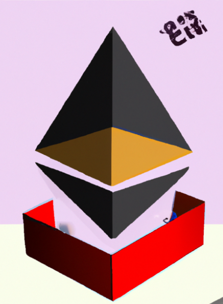

# Toy EVM

<p align="center">
  
</p>


The goal of this project is to build the EVM from scratch. This project doesn't aim to be feature complete, performant, or production ready.

The specification in the Ethereum Yellow Paper is extremely rigorous. At the same time,  it is a dry read and difficult to understand.

With this project, I want to create a playground to tinker with EVM primitives. The main purpose is to understand the internals and the core concepts underpinning the EVM.

#### Current status:

- Implements 21/140 [opcodes](https://github.com/avichalp/toy-evm/blob/master/evm/instructions.go#L34-L56).
- [Stack](https://github.com/avichalp/toy-evm/blob/master/evm/stack.go) operations
- [Memory](https://github.com/avichalp/toy-evm/blob/master/evm/memory.go) load, store, and growth
- [Storage](https://github.com/avichalp/toy-evm/blob/master/evm/storage.go) operations
- calldata and returndata
- [Jump Destination validation](https://github.com/avichalp/toy-evm/blob/2ef15a71f8d773ca72f3f68c70ad07a6525117b8/evm/execution.go#L113-L137) restricts invalid code jumps.
- Static gas account: Constant gas cost for opcodes. Gas accounting for memory growth, self destruct,  etc. is not yet implemented.


#### Requirements

- [Go](https://go.dev/doc/install)

#### Run tests
```sh
go test ./...
```

#### Examples
```sh
go run ./... -code 6001600055 -gas 50 
```

```sh
go run ./... -code 60048060005b8160125760005360016000f35b8201906001900390600556 -gas 1550
```

